# InsureSense 360 - Complete Process Map

This document provides a comprehensive overview of the entire InsureSense 360 workflow, from policy processing to vector store integration and API usage.

## Overall Architecture

## 1. Data Processing Pipeline

### 1.1 Policy Ingestion

### 1.2 Enhanced Information Extraction

## 2. Vector Store Integration

### 2.1 Data to Embeddings Flow

### 2.2 Search and Retrieval

## 3. RAG Chatbot System

### 3.1 Chat Flow

### 3.2 Conversation Memory

## 4. API Endpoints Architecture

### 4.1 Core Endpoints

### 4.2 Data Flow Through API

## 5. Complete End-to-End Workflow

### 5.1 Policy Processing Workflow

### 5.2 User Interaction Workflow

## 6. System Components Overview

### 6.1 Core Modules

### 6.2 Data Flow Architecture

## 7. Current Implementation Status

### 7.1 Completed Components

```mermaid
graph LR
    A[✓ Document Processor] --> B[✓ Policy Extraction]
    B --> C[✓ JSON Storage]
    C --> D[✓ CSV Export]
    D --> E[Vector Store Ready]
    E --> F[API Endpoints]
    F --> G[User Interface Ready]
    
    style A fill:#90EE90
    style B fill:#90EE90
    style C fill:#90EE90
    style D fill:#90EE90
    style E fill:#FFA500
    style F fill:#FFA500
    style G fill:#FFA500
```

### 7.2 Next Steps

## 8. Data Flow Summary

### 8.1 Policy Processing Flow
1. **Input**: PDF policy documents from `lic_policies/` directory
2. **Processing**: 
   - Document parsing using LangChain loaders
   - Text extraction and section identification
   - Policy structuring into InsurancePolicy objects
3. **Storage**: 
   - Individual JSON files in `data/processed/`
   - Enhanced CSV in `data/extracted/enhanced_lic_policies.csv`
4. **Vectorization**: 
   - Policy sections converted to embeddings
   - Stored in FAISS/Chroma vector store
5. **Usage**: 
   - Semantic search via API endpoints
   - RAG chatbot context retrieval

### 8.2 User Query Flow
1. **Input**: User question through API or chat interface
2. **Processing**:
   - Query embedding generation
   - Similarity search in vector store
   - Context retrieval from relevant policies
3. **Response**:
   - LLM response generation with policy context
   - Source citations and confidence scoring
   - Formatted output for user consumption

## 9. System Capabilities

### 9.1 Current Features
- ✅ Process 10+ LIC policy PDFs
- ✅ Extract detailed policy information (benefits, exclusions, premiums, etc.)
- ✅ Generate structured JSON and CSV outputs
- ✅ Vector store ready for semantic search
- ✅ API endpoints for all core functionality
- ✅ RAG chatbot framework implemented

### 9.2 Upcoming Enhancements
- 🔄 Add processed policies to vector store
- 🔄 Enable full semantic search capabilities
- 🔄 Activate advanced RAG chatbot features
- 🔄 Implement conversation memory persistence
- 🔄 Add multi-language support
- 🔄 Integrate with Azure services

This comprehensive process map shows how all components of InsureSense 360 work together to provide an intelligent insurance policy analysis platform.